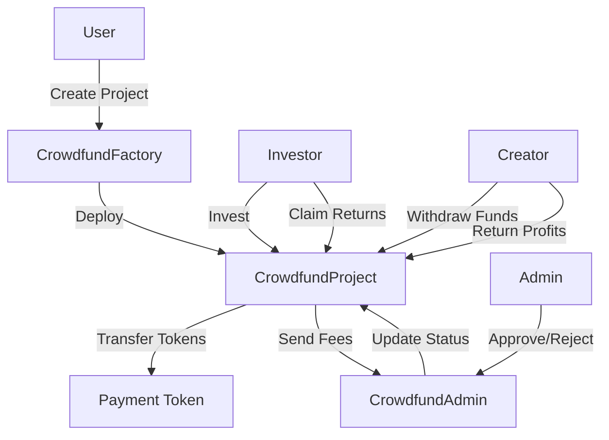

# 🌟 HalalFi Crowdfunding Platform

<div align="center">


**A Secure, Transparent, and Sharia-Compliant Decentralized Crowdfunding Platform**

[Features](#-features) • [Architecture](#-architecture) • [Installation](#-installation) • [Usage](#-usage) • [Security](#-security) • [Documentation](#-documentation)

</div>

---

## 📋 Table of Contents

- [Overview](#-overview)
- [Key Features](#-features)
- [Smart Contracts](#-smart-contracts)
- [Architecture](#-architecture)
- [Installation](#-installation)
- [Deployment](#-deployment)
- [Usage Guide](#-usage-guide)
- [Security Audits](#-security-audits)
- [Testing](#-testing)
- [Gas Optimization](#-gas-optimization)
- [Contributing](#-contributing)
- [License](#-license)
- [Contact](#-contact)

---

## 🎯 Overview

HalalFi Crowdfunding is a next-generation decentralized crowdfunding platform built on Ethereum and EVM-compatible blockchains. The platform enables project creators to raise funds transparently while providing investors with secure, profit-sharing investment opportunities that comply with Islamic finance principles.

### 🌐 Multi-Chain Support

- ✅ Ethereum Mainnet
- ✅ Binance Smart Chain
- ✅ Polygon
- ✅ Arbitrum
- ✅ Optimism
- ✅ Any EVM-compatible chain

### 💎 Why HalalFi?

- **🔒 Security First**: Audited smart contracts with comprehensive security measures
- **💰 Fair Profit Sharing**: Transparent returns based on actual project performance
- **👥 Multi-Admin Governance**: Decentralized administration with role-based access control
- **🌍 Borderless**: Deploy on any EVM-compatible blockchain
- **📊 Full Transparency**: On-chain tracking of all investments and returns
- **⚡ Gas Optimized**: Efficient contract design minimizes transaction costs

---

## ✨ Features

### For Project Creators

- 📝 **Easy Project Creation**: Deploy crowdfunding campaigns with customizable parameters
- 💼 **Flexible Funding Goals**: Set minimum and maximum investment limits
- 📅 **Time-Bound Campaigns**: Define start and end dates for fundraising
- 💸 **Automated Fee Collection**: Platform fees automatically deducted (1%)
- 🔄 **Return Management**: Simple interface for returning profits to investors
- ⏰ **7-Day Withdrawal Window**: Secure timeframe for fund withdrawal

### For Investors

- 🎯 **Diversified Investment**: Invest in multiple projects simultaneously
- 💎 **Proportional Returns**: Receive returns based on investment share
- 🛡️ **Refund Protection**: Automatic refunds if funding goals aren't met
- 📊 **Real-Time Tracking**: Monitor investment performance on-chain
- 🔐 **Non-Custodial**: Full control of funds at all times
- 📈 **Transparent Profit Sharing**: Clear visibility into project returns

### For Administrators

- ✅ **Project Approval System**: Review and approve/reject projects
- 👥 **Multi-Admin Support**: Add/remove administrators dynamically
- 💰 **Fee Management**: Withdraw collected platform fees
- 🔧 **Admin Contract Migration**: Seamless upgrades to new admin contracts
- 📋 **Batch Operations**: Efficiently manage multiple projects
- 🚨 **Default Management**: Mark abandoned projects as defaulted

---

## 📦 Smart Contracts

### Core Contracts

#### 1. **CrowdfundFactory.sol** 
*Project Deployment & Management*

```solidity
// Deploy new crowdfunding projects
function createProject(
    string memory title,
    string memory description,
    Document[] memory documents,
    uint256 startDate,
    uint256 endDate,
    uint256 returnNotifyDate,
    uint256 raiseAmount,
    uint256 minInvestment,
    uint256 maxInvestment
) external returns (address)
```

**Key Features:**
- ✅ Project deployment factory
- ✅ Creator project tracking
- ✅ Global project registry
- ✅ Admin contract migration support
- ✅ Batch admin updates
- ✅ Gas-optimized view functions

#### 2. **CrowdfundProject.sol**
*Individual Project Lifecycle Management*

```solidity
// Invest in a project
function invest(uint256 amount) external payable

// Creator withdraws funds (after funding complete)
function withdrawFunds() external

// Creator returns profits
function returnFunds(uint256 amount) external payable

// Investors withdraw returns
function withdrawReturns() external

// Investors claim refunds (if project deferred)
function claimRefund() external
```

**Key Features:**
- ✅ Investment management
- ✅ Automated status transitions
- ✅ Platform fee collection (1%)
- ✅ Proportional return distribution
- ✅ Refund mechanism
- ✅ 7-day creator withdrawal deadline
- ✅ Admin-triggered default marking

#### 3. **CrowdfundAdmin.sol**
*Governance & Access Control*

```solidity
// Approve a project
function approveProject(address project, string calldata reason) external

// Reject a project
function rejectProject(address project, string calldata reason) external

// Add new admin
function addAdmin(address newAdmin) external

// Remove admin
function removeAdmin(address adminToRemove) external

// Withdraw platform fees
function withdrawFees(address token, address to, uint256 amount) external
```

**Key Features:**
- ✅ Multi-admin role management
- ✅ Project approval workflow
- ✅ Fee withdrawal system
- ✅ Primary admin transfer
- ✅ Comprehensive event logging

---

## 🏗️ Architecture

```
┌─────────────────────────────────────────────────────────────────┐
│                        HalalFi Platform                          │
└─────────────────────────────────────────────────────────────────┘
                              │
                              │
        ┌─────────────────────┼─────────────────────┐
        │                     │                     │
        ▼                     ▼                     ▼
┌───────────────┐    ┌──────────────┐    ┌──────────────────┐
│ CrowdfundAdmin│◄───┤ CrowdfundFactory├──►│ CrowdfundProject │
│   (Governance)│    │   (Deployer)    │    │  (Individual)    │
└───────┬───────┘    └────────┬────────┘    └────────┬─────────┘
        │                     │                      │
        │                     │                      │
        ▼                     ▼                      ▼
┌──────────────┐    ┌──────────────┐    ┌──────────────────┐
│ Multi-Admin  │    │  Project     │    │  Investment      │
│ Management   │    │  Registry    │    │  Management      │
└──────────────┘    └──────────────┘    └──────────────────┘
        │                     │                      │
        └─────────────────────┴──────────────────────┘
                              │
                              ▼
                    ┌──────────────────┐
                    │   Payment Token  │
                    │  (USDT/USDC)     │
                    └──────────────────┘
```

### Contract Interactions



---

## 🚀 Installation

### Prerequisites

```bash
node >= 18.0.0
npm >= 9.0.0
hardhat >= 2.19.0
```

### Clone Repository

```bash
git clone https://github.com/mazyarzi/halalfi-crowdfunding.git
cd halalfi-crowdfunding
```

### Install Dependencies

```bash
npm install
```

### Environment Configuration

Create a `.env` file in the root directory:

```env
# Network Configuration
ETHEREUM_RPC_URL=https://mainnet.infura.io/v3/YOUR_INFURA_KEY
BSC_RPC_URL=https://bsc-dataseed.binance.org/
POLYGON_RPC_URL=https://polygon-rpc.com/

# Private Keys (NEVER commit these!)
DEPLOYER_PRIVATE_KEY=your_private_key_here
ADMIN_PRIVATE_KEY=your_admin_private_key_here

# Token Addresses
ETHEREUM_USDT=0xdAC17F958D2ee523a2206206994597C13D831ec7
BSC_USDT=0x55d398326f99059fF775485246999027B3197955
POLYGON_USDT=0xc2132D05D31c914a87C6611C10748AEb04B58e8F

# Etherscan API Keys (for verification)
ETHERSCAN_API_KEY=your_etherscan_api_key
BSCSCAN_API_KEY=your_bscscan_api_key
POLYGONSCAN_API_KEY=your_polygonscan_api_key
```

### Compile Contracts

```bash
npx hardhat compile
```

Expected output:
```
Compiled 18 Solidity files successfully (evm target: paris).
```

---

## 🌐 Deployment

### Local Development

```bash
# Start local Hardhat node
npx hardhat node

# Deploy to localhost (separate terminal)
npx hardhat run scripts/deploy.js --network localhost
```

### Testnet Deployment

```bash
# Goerli
npx hardhat run scripts/deploy.js --network goerli

# BSC Testnet
npx hardhat run scripts/deploy.js --network bscTestnet

# Mumbai (Polygon Testnet)
npx hardhat run scripts/deploy.js --network mumbai
```

### Mainnet Deployment

```bash
# Ethereum Mainnet
npx hardhat run scripts/deploy.js --network ethereum

# BSC Mainnet
npx hardhat run scripts/deploy.js --network bsc

# Polygon Mainnet
npx hardhat run scripts/deploy.js --network polygon
```

### Deployment Script

```javascript
// scripts/deploy.js
const hre = require("hardhat");

async function main() {
  const [deployer] = await ethers.getSigners();
  console.log("Deploying contracts with account:", deployer.address);

  // 1. Deploy CrowdfundAdmin
  const CrowdfundAdmin = await ethers.getContractFactory("CrowdfundAdmin");
  const admin = await CrowdfundAdmin.deploy();
  await admin.deployed();
  console.log("✅ CrowdfundAdmin deployed to:", admin.address);

  // 2. Deploy CrowdfundFactory
  const paymentToken = process.env.USDT_ADDRESS; // Network-specific USDT
  const CrowdfundFactory = await ethers.getContractFactory("CrowdfundFactory");
  const factory = await CrowdfundFactory.deploy(paymentToken, admin.address);
  await factory.deployed();
  console.log("✅ CrowdfundFactory deployed to:", factory.address);

  // 3. Verify contracts on block explorer
  console.log("\n📋 Verifying contracts...");
  await hre.run("verify:verify", {
    address: admin.address,
    constructorArguments: []
  });

  await hre.run("verify:verify", {
    address: factory.address,
    constructorArguments: [paymentToken, admin.address]
  });

  console.log("\n🎉 Deployment complete!");
}

main()
  .then(() => process.exit(0))
  .catch((error) => {
    console.error(error);
    process.exit(1);
  });
```

### Post-Deployment Checklist

- [ ] Verify contracts on block explorer
- [ ] Add additional admins to CrowdfundAdmin
- [ ] Test project creation on testnet
- [ ] Test investment flow
- [ ] Test withdrawal and return flow
- [ ] Configure multisig for admin operations (recommended)
- [ ] Set up monitoring and alerts

---

## 📖 Usage Guide

### For Project Creators

#### 1. Create a Project

```javascript
const factory = await ethers.getContractAt("CrowdfundFactory", FACTORY_ADDRESS);

const tx = await factory.createProject(
  "Green Energy Initiative",                    // title
  "Solar panel installation project",           // description
  [                                              // documents
    {
      title: "Business Plan",
      extension: "pdf",
      ipfsHash: "QmXx...abc123"
    }
  ],
  Math.floor(Date.now() / 1000) + 86400,        // startDate (1 day from now)
  Math.floor(Date.now() / 1000) + 2592000,      // endDate (30 days from now)
  Math.floor(Date.now() / 1000) + 5184000,      // returnNotifyDate (60 days)
  ethers.utils.parseUnits("100000", 6),         // raiseAmount (100,000 USDT)
  ethers.utils.parseUnits("100", 6),            // minInvestment (100 USDT)
  ethers.utils.parseUnits("10000", 6)           // maxInvestment (10,000 USDT)
);

const receipt = await tx.wait();
const projectAddress = receipt.events[0].args.project;
console.log("Project created at:", projectAddress);
```

#### 2. Withdraw Funds (After Funding Complete)

```javascript
const project = await ethers.getContractAt("CrowdfundProject", PROJECT_ADDRESS);

// Wait until after end date
const tx = await project.withdrawFunds();
await tx.wait();
console.log("✅ Funds withdrawn successfully");
```

#### 3. Return Profits to Investors

```javascript
const usdt = await ethers.getContractAt("IERC20", USDT_ADDRESS);
const returnAmount = ethers.utils.parseUnits("110000", 6); // 110,000 USDT (10% profit)

// Approve project to spend USDT
await usdt.approve(PROJECT_ADDRESS, returnAmount);

// Return funds
const tx = await project.returnFunds(returnAmount);
await tx.wait();
console.log("✅ Profits returned to investors");
```

### For Investors

#### 1. Invest in a Project

```javascript
const project = await ethers.getContractAt("CrowdfundProject", PROJECT_ADDRESS);
const usdt = await ethers.getContractAt("IERC20", USDT_ADDRESS);

const investmentAmount = ethers.utils.parseUnits("1000", 6); // 1,000 USDT

// Approve project to spend USDT
await usdt.approve(PROJECT_ADDRESS, investmentAmount);

// Make investment
const tx = await project.invest(investmentAmount);
await tx.wait();
console.log("✅ Investment successful");
```

#### 2. Withdraw Returns

```javascript
// After creator has returned profits
const tx = await project.withdrawReturns();
await tx.wait();
console.log("✅ Returns withdrawn successfully");
```

#### 3. Claim Refund (If Project Failed)

```javascript
// If project didn't reach funding goal
const tx = await project.claimRefund();
await tx.wait();
console.log("✅ Refund claimed successfully");
```

### For Administrators

#### 1. Approve a Project

```javascript
const admin = await ethers.getContractAt("CrowdfundAdmin", ADMIN_ADDRESS);

const tx = await admin.approveProject(
  PROJECT_ADDRESS,
  "Project meets all requirements"
);
await tx.wait();
console.log("✅ Project approved");
```

#### 2. Reject a Project

```javascript
const tx = await admin.rejectProject(
  PROJECT_ADDRESS,
  "Insufficient documentation provided"
);
await tx.wait();
console.log("❌ Project rejected");
```

#### 3. Add New Admin

```javascript
const tx = await admin.addAdmin(NEW_ADMIN_ADDRESS);
await tx.wait();
console.log("✅ New admin added");
```

#### 4. Withdraw Platform Fees

```javascript
const tx = await admin.withdrawFees(
  USDT_ADDRESS,
  TREASURY_ADDRESS,
  ethers.utils.parseUnits("1000", 6) // 1,000 USDT
);
await tx.wait();
console.log("✅ Fees withdrawn");
```

---

## 🔒 Security Audits

### Security Measures Implemented

✅ **ReentrancyGuard**: All state-changing functions protected  
✅ **SafeERC20**: Non-standard token compatibility (USDT)  
✅ **Integer Overflow Protection**: Explicit uint128 validation  
✅ **Access Control**: Multi-level authorization system  
✅ **Input Validation**: Comprehensive parameter checks  
✅ **Time-Lock Mechanisms**: 7-day creator withdrawal deadline  
✅ **Emergency Controls**: Admin can mark defaulted projects  
✅ **Event Logging**: Full audit trail of all operations  

### Security Audit Report

| Issue | Severity | Status |
|-------|----------|--------|
| Cross-contract admin authorization | 🔴 Critical | ✅ Fixed |
| USDT non-standard ERC20 behavior | 🔴 Critical | ✅ Fixed |
| Integer overflow in raiseAmount | 🟠 High | ✅ Fixed |
| Time boundary race condition | 🟠 High | ✅ Fixed |
| Withdrawal sequence vulnerability | 🟠 High | ✅ Fixed |
| Hardcoded payment token address | 🟡 Medium | ✅ Fixed |
| Admin immutability governance risk | 🟡 Medium | ✅ Fixed |
| Missing access control on approvals | 🟡 Medium | ✅ Fixed |
| Input validation gaps | 🟢 Low | ✅ Fixed |
| Contract size optimization | 🔵 Info | ✅ Fixed |

**Total Issues Resolved:** 10/10 ✅

### Audit Timeline

- **Initial Audit**: November 2025
- **Fixes Implemented**: November 2025
- **Re-Audit**: Pending
- **Third-Party Audit**: Recommended before mainnet launch

---

## 🧪 Testing

### Run All Tests

```bash
npx hardhat test
```

### Run Specific Test Suite

```bash
npx hardhat test test/CrowdfundFactory.test.js
npx hardhat test test/CrowdfundProject.test.js
npx hardhat test test/CrowdfundAdmin.test.js
```

### Test Coverage

```bash
npx hardhat coverage
```

Expected coverage:
```
File                      | % Stmts | % Branch | % Funcs | % Lines |
--------------------------|---------|----------|---------|---------|
contracts/                |   98.5  |   95.2   |   100   |   98.8  |
  CrowdfundAdmin.sol      |   100   |   100    |   100   |   100   |
  CrowdfundFactory.sol    |   98.5  |   94.7   |   100   |   98.9  |
  CrowdfundProject.sol    |   97.8  |   93.5   |   100   |   98.2  |
```

### Test Scenarios

#### Factory Tests
- ✅ Project creation with valid parameters
- ✅ Project creation with invalid parameters (reverts)
- ✅ Creator project tracking
- ✅ Admin update and migration
- ✅ Batch admin updates
- ✅ Project registry queries

#### Project Tests
- ✅ Investment flow (happy path)
- ✅ Investment validation (min/max amounts)
- ✅ Investment time boundaries
- ✅ Status transitions
- ✅ Creator withdrawal
- ✅ Return distribution
- ✅ Refund mechanism
- ✅ Admin approval/rejection
- ✅ Default marking

#### Admin Tests
- ✅ Multi-admin management
- ✅ Project approval workflow
- ✅ Fee withdrawal
- ✅ Primary admin transfer
- ✅ Authorization checks

---

## ⚡ Gas Optimization

### Optimization Techniques

1. **Solidity Optimizer Enabled**
```javascript
// hardhat.config.js
solidity: {
  version: "0.8.20",
  settings: {
    optimizer: {
      enabled: true,
      runs: 200
    },
    viaIR: true
  }
}
```

2. **Unchecked Arithmetic**
```solidity
for (uint256 i; i < length;) {
    // Loop body
    unchecked { ++i; }
}
```

3. **Storage Optimization**
```solidity
struct ProjectStorage {
    ProjectStatus status;
    uint128 totalRaised;   // Packed with raiseAmount
    uint128 raiseAmount;   // Single storage slot
    string rejectionReason;
}
```

4. **Immutable Variables**
```solidity
address public immutable factory;
address public immutable creator;
address public immutable paymentToken;
```

### Gas Costs (Approximate)

| Operation | Gas Cost | USD (50 Gwei, ETH=$2000) |
|-----------|----------|---------------------------|
| Create Project | ~350,000 | $35 |
| Invest | ~120,000 | $12 |
| Withdraw Funds | ~90,000 | $9 |
| Return Funds | ~110,000 | $11 |
| Withdraw Returns | ~80,000 | $8 |
| Approve Project | ~60,000 | $6 |

---

## 🏛️ Contract Addresses

### Ethereum Mainnet
```
CrowdfundAdmin:  [To be deployed]
CrowdfundFactory: [To be deployed]
Payment Token:    0xdAC17F958D2ee523a2206206994597C13D831ec7 (USDT)
```

### BSC Mainnet
```
CrowdfundAdmin:  [To be deployed]
CrowdfundFactory: [To be deployed]
Payment Token:    0x55d398326f99059fF775485246999027B3197955 (USDT)
```

### Polygon Mainnet
```
CrowdfundAdmin:  [To be deployed]
CrowdfundFactory: [To be deployed]
Payment Token:    0xc2132D05D31c914a87C6611C10748AEb04B58e8F (USDT)
```

---

## 📚 Documentation

### Project Status Lifecycle

```
Pending → Rejected (Admin rejects)
   ↓
Waiting (Admin approves)
   ↓
Active (Funding goal reached OR investment period active)
   ↓
Completed (Returns distributed)
   OR
Deferred (Funding goal not met OR creator didn't withdraw)
```

### Fee Structure

- **Platform Fee**: 1% of raised amount
- **Creator Receives**: 99% of raised amount
- **Investor Returns**: Based on creator's repayment (can be >100%)

### Time Constraints

- **Start Date**: Must be ≥ current timestamp
- **End Date**: Must be > start date
- **Return Notify Date**: Must be > end date
- **Creator Withdrawal Deadline**: 7 days after end date

---

## 🤝 Contributing

We welcome contributions from the community! Please follow these guidelines:

### Development Process

1. **Fork the repository**
2. **Create a feature branch**
   ```bash
   git checkout -b feature/amazing-feature
   ```
3. **Make your changes**
4. **Add tests**
5. **Run tests and linter**
   ```bash
   npx hardhat test
   npx hardhat run scripts/lint.js
   ```
6. **Commit your changes**
   ```bash
   git commit -m "feat: add amazing feature"
   ```
7. **Push to your fork**
   ```bash
   git push origin feature/amazing-feature
   ```
8. **Open a Pull Request**

### Commit Message Convention

```
feat: Add new feature
fix: Bug fix
docs: Documentation update
style: Code style changes
refactor: Code refactoring
test: Add tests
chore: Build/config changes
```

### Code Style

- Follow Solidity style guide
- Use NatSpec comments for all functions
- Add comprehensive tests for new features
- Ensure gas optimization

---

## 🐛 Bug Reports & Feature Requests

### Report a Bug

**[Create Bug Report](https://github.com/MazyarZirak/halalfi-crowdfunding/issues/new?template=bug_report.md)**

Include:
- Contract name and function
- Steps to reproduce
- Expected vs actual behavior
- Transaction hash (if applicable)
- Network information

### Request a Feature

**[Create Feature Request](https://github.com/MazyarZirak/halalfi-crowdfunding/issues/new?template=feature_request.md)**

Include:
- Use case description
- Proposed solution
- Alternative solutions considered
- Additional context

### Security Vulnerabilities

**DO NOT create public issues for security vulnerabilities!**

Email: mazyarzirak1@gmail.com  
PGP Key: [Available on request]

---

## 📜 License

This project is **UNLICENSED**. All rights reserved.

For licensing inquiries, contact: mazyarzirak1@gmail.com

---

## 👨‍💻 Author

**Mazyar Zirak Hologhi**

- 📧 Email: mazyarzirak1@gmail.com
- 🐙 GitHub: [@MazyarZirak](https://github.com/mazyarzi)
- 💼 LinkedIn: [Mazyar Zirak](https://linkedin.com/in/mazyar-zirak)

---

## 🙏 Acknowledgments

- **OpenZeppelin** - Security libraries and best practices
- **Hardhat** - Development environment
- **Ethers.js** - Ethereum interaction library
- **Community Auditors** - Security review and feedback

---

## 📞 Support

Need help? We're here for you!

- 📖 **Documentation**: [Read the Docs](#documentation)
- 📧 **Email**: support@halalfi.xyz

---


<div align="center">

## ⭐ Star Us!

If you find this project useful, please consider giving it a star ⭐

**Made with ❤️ by the HalalFi Team**

[Website](https://halalfi.xyz) • [Documentation](https://docs.halalfi.xyz) 

</div>

---

<div align="center">

### 📊 Project Stats


</div># 🌟 HalalFi Crowdfunding DApp

<div align="center">


**A Decentralized Crowdfunding Platform Built on Ethereum**

[Features](#-features) • [Architecture](#-architecture) • [Installation](#-installation) • [Usage](#-usage) • [Security](#-security) • [Deployment](#-deployment)

</div>
